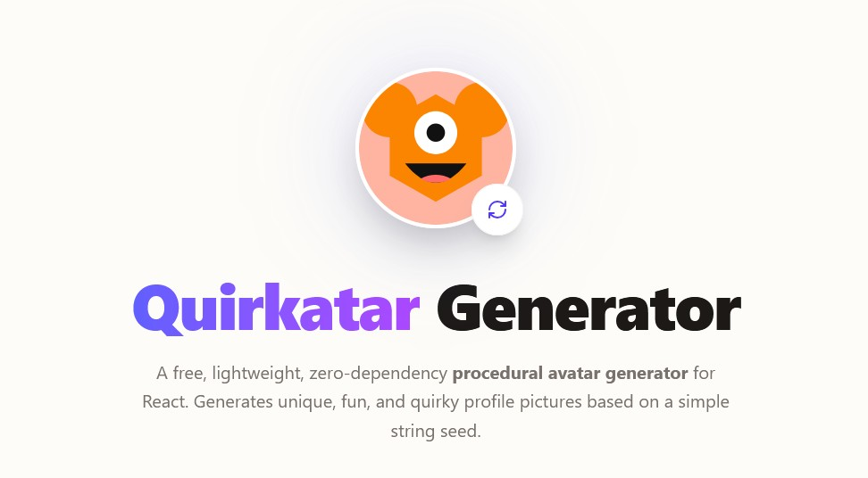
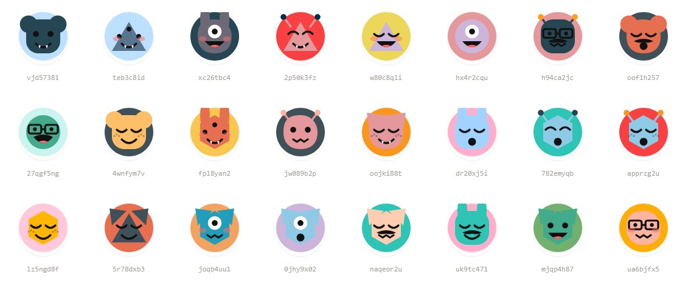

<div align="center">
  
  <h1>✨ Quirkatar Generator</h1>
  <p>A free, lightweight, zero-dependency procedural avatar generator</p>

  <a href="https://noizefield.github.io/quirkatar-avatar-generator/">
    
  </a>
</div>

# Quirkatar 👾

> A free, lightweight, zero-dependency procedural avatar generator.

Create unique, funny, and random avatars instantly from a seed string. Perfect for user profiles, default avatars, and adding a touch of personality to your application.



## Features

- 🪶 **Zero Dependencies:** Built entirely with Vanilla JavaScript and SVG. No heavy libraries, no external network requests. Just pure, fast rendering.
- 🎲 **Deterministic Seeds:** The same seed string will always generate the exact same avatar. Perfect for hashing user IDs or email addresses.
- ♾️ **Infinite Combinations:** With various head shapes, eyes, mouths, ears, and a carefully curated color palette, the possibilities are endless.
- 🎨 **Fully Customizable:** Easily adjust the size and shape (circle or square).
- ⚡ **Lightweight:** Minimal footprint, making it perfect for any web project.

## Installation

Quirkatar is a simple Vanilla JavaScript library. Simply include the `avatar.js` file in your project.

```html
<script src="path/to/avatar.js"></script>
```

## Usage

You can use the `generateAvatarSvg(seed, size, square)` function to generate the raw SVG string, which you can then inject into any HTML element.

```html
<div id="avatar-container"></div>

<script>
  // Generates a unique avatar based on the user's email or ID
  const svgString = generateAvatarSvg("user@example.com", 120);
  
  // Inject the SVG into the DOM
  document.getElementById('avatar-container').innerHTML = svgString;
</script>
```

## API
### `generateAvatarSvg(seed, size, square)`

| Parameter | Type | Default | Description |
|---|---|---|---|
| `seed` | `string` | **Required** | The string used to deterministically generate the avatar. |
| `size` | `number` | `100` | The width and height of the avatar in pixels. |
| `square` | `boolean` | `false` | If true, renders a square avatar instead of a circle. |

## License

MIT License. Free to use in personal and commercial projects.
